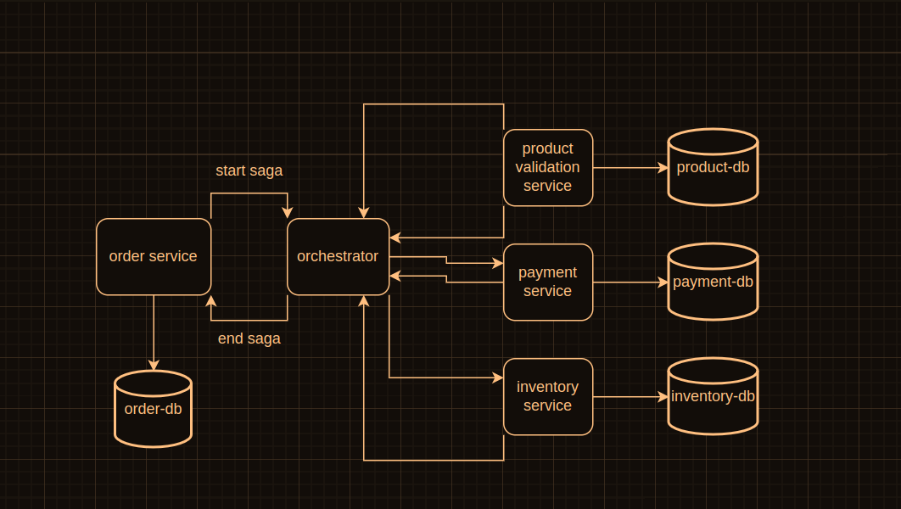

## Arquitetura Saga Orquestrado

### Project setup

```bash
$ npm install
```

### Compile and run the project

```bash
$ yarn infra
```

```bash
$ yarn migration:run
```

#### Payload

- start-saga

docs: http://localhost:4000/docs

```
{
  "id": "64429e9a7a8b646915b37360",
  "transactionId": "1682087576536_99d2ca6c-f074-41a6-92e0-21700148b519",
  "orderId": "64429e987a8b646915b3735f",
  "payload": {
    "id": "64429e987a8b646915b3735f",
    "products": [
      {
        "product": {
          "code": "COMIC_BOOKS",
          "unitValue": 15.5
        },
        "quantity": 1
      }
    ]
  },
  "eventHistory": []
}
```

---

### Architerure



Nest is [MIT licensed](https://github.com/nestjs/nest/blob/master/LICENSE).
